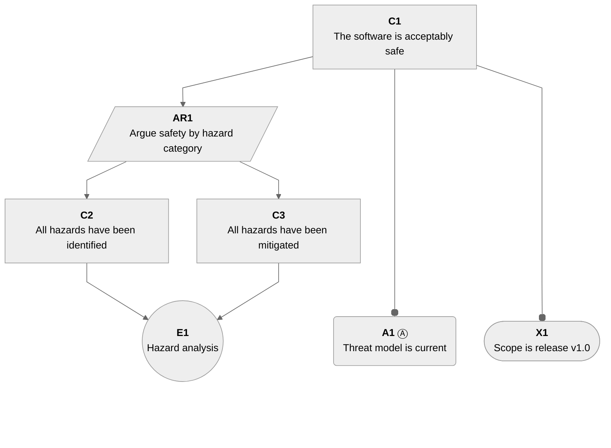

```mermaid
---
config:
  theme: neutral
  flowchart:
    curve: linear
    htmlLabels: true
    rankSpacing: 60
    nodeSpacing: 45
    padding: 15
---
flowchart TD
    classDef invisible opacity:0
    classDef gsnUndev stroke-width:2px,stroke-dasharray: 5 5;
    C1["<b>C1</b><br>The software is acceptably safe"]
    AR1[/"<b>AR1</b><br>Argue safety by hazard category"/]
    A1("<b>A1</b>&nbsp;Ⓐ<br>Threat model is current")
    X1(["<b>X1</b><br>Scope is release v1.0"])
    C2["<b>C2</b><br>All hazards have been identified"]
    C3["<b>C3</b><br>All hazards have been mitigated"]
    E1(("<b>E1</b><br>Hazard analysis"))
    click X1 "release-notes.md"
    click E1 "hara.pdf"

    E1 ~~~ BottomPadding[ ]:::invisible
    A1 ~~~ BottomPadding
    X1 ~~~ BottomPadding
    C1 --> AR1
    AR1 --> C2
    C2 --> E1
    AR1 --> C3
    C3 --> E1
    C1 --o A1
    C1 --o X1
```
